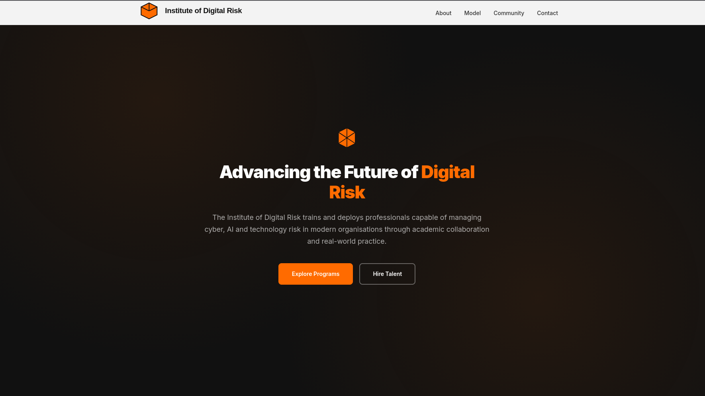
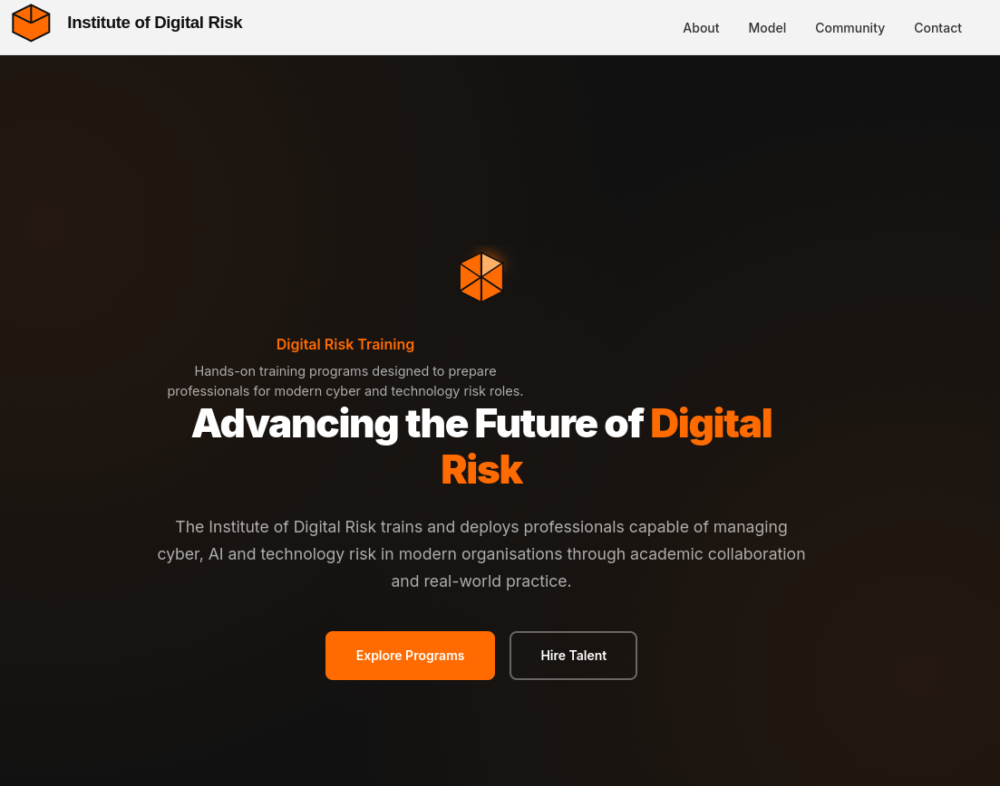
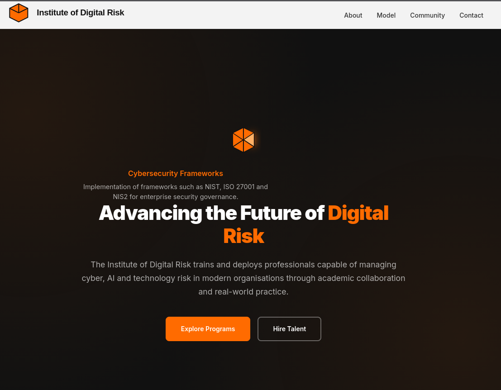
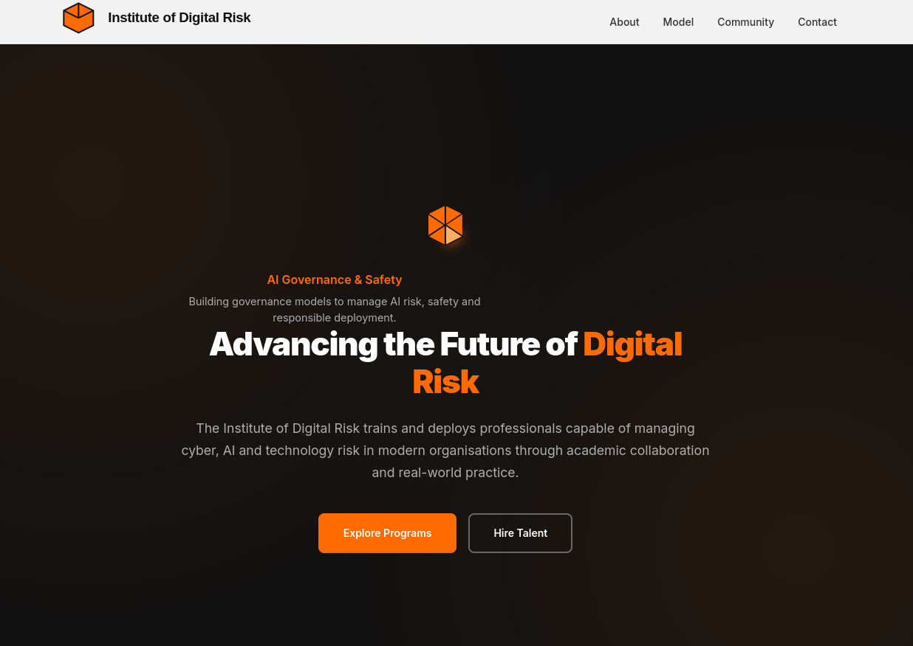

## Project Preview

<p align="center">
  
</p>

<p align="center">
  
</p>

### Hero Component Variants

<p align="center">
  
  
  
</p>

# Institute of Digital Risk (IDR) – Brand & Homepage Design

This repository contains a **brand design and responsive homepage project** for the **Institute of Digital Risk (IDR)**. The goal of this assignment is to design a **logo** and develop a **modern, responsive single-page website** that clearly communicates the mission and services of IDR.

The Institute of Digital Risk focuses on **training and deploying professionals in digital, cyber, and AI risk management**, combining academic knowledge with real-world industry practices.

---

# Project Overview

The project consists of two main components:

1. **Logo Design**
2. **Responsive Homepage Website**

The design reflects a **technology-focused, professional, and minimalist aesthetic** suitable for an institute specializing in digital risk and cybersecurity education.

---

# Logo Design

The logo represents **structure, resilience, and risk management**, using a **geometric cube-inspired design**.

## Design Elements

- **Shape**: Cube-inspired geometric icon representing structure and stability
- **Color Palette**:
  - Orange – innovation and energy
  - Black – strength and professionalism
  - White – simplicity and clarity
- **Style**: Clean and modern technology/education aesthetic
- **Variants**:
  - Icon only
  - Icon + text **“Institute of Digital Risk”**

The logo is designed to remain **legible at small sizes**, making it suitable for:

- Favicons
- Mobile headers
- Website navigation bars

---

# Homepage Website

A **single-page responsive website** was created to explain the purpose and services of IDR.

The site is built using **semantic HTML5**, **CSS**, and **vanilla JavaScript** without any external frameworks.

---

# Website Sections

## Hero Section

The hero section introduces the institute and its mission.

Features:

- Headline representing the mission  
  **“Advancing the Future of Digital Risk”**

- Subheading explaining that IDR trains and deploys digital risk practitioners through academic collaboration and industry practice.

- Call-to-action buttons such as:

```
Explore Programs
Hire Talent
```

---

## About IDR

This section explains the role of the institute.

Key points include:

- IDR is an **industry-led training and deployment institute**
- Focused on preparing professionals for **digital, cyber, and technology risk roles**
- Operates in **regulated and high-consequence environments**
- Combines **academic partnerships (including UK universities)** with **real-world industry projects**

---

## Service Pillars

The IDR model is structured around three core pillars.

### Academy

Training programs and bootcamps designed for:

- Students
- Early-career professionals
- Industry practitioners

Focused on digital risk, cybersecurity, and governance skills.

### Innovation & Incubation

Development of:

- Digital risk intellectual property
- Future risk frameworks
- AI governance models

Encourages research and innovation in digital risk.

### Advisory Services

Consulting support for organizations implementing cybersecurity and governance frameworks such as:

- NIST
- ISO 27001
- NIS2

Helps companies strengthen their digital risk management practices.

---

## Community / Who We Serve

The institute supports a broad community including:

- Students
- Early-career professionals
- Cybersecurity practitioners
- Technology risk specialists

Target sectors include:

- Financial services
- Critical infrastructure
- Regulated industries

The focus is on **upskilling professionals in digital and cyber risk management**.

---

## Contact Section

The homepage includes a simple contact form allowing visitors to register interest or reach out.

Example fields include:

```
Name
Email
Message
```

This section acts as a **call-to-action for prospective students, partners, and organizations**.

---

# Technical Implementation

The website follows modern web development best practices.

## HTML

Semantic HTML5 structure is used:

```
<header>
<nav>
<main>
<section>
<footer>
```

---

## CSS

- Responsive layout using **Flexbox and CSS Grid**
- Mobile-first design
- Accessible color contrast
- Hover effects for buttons and navigation links
- Sticky navigation bar

---

## JavaScript

Used for:

- Smooth scrolling navigation
- Interactive elements
- Basic UI behavior

---

# Technical Requirements

The project follows these constraints:

- Semantic HTML5
- Responsive design for **desktop and mobile**
- Sticky navigation bar
- Smooth scrolling between sections
- Accessible color contrast
- Web-safe or Google fonts
- Hover states for UI elements
- **No CSS frameworks (Bootstrap, Tailwind, etc.)**

---

# Tech Stack

- HTML5
- CSS3
- JavaScript (Vanilla)

---

# Project Structure

```
idr-homepage/
│
├── index.html
├── style.css
├── script.js
│
├── assets/
│   ├── logo-icon.png
│   ├── logo-full.png
│   └── favicon.png
│
└── README.md
```

---

# Learning Objectives

This project demonstrates:

- Brand identity design
- Responsive web design
- Semantic HTML development
- Clean UI/UX for institutional websites
- Vanilla front-end development without frameworks

---

# Author

**Tamoghna Saha**

GitHub Repository created as part of a design and development assignment.